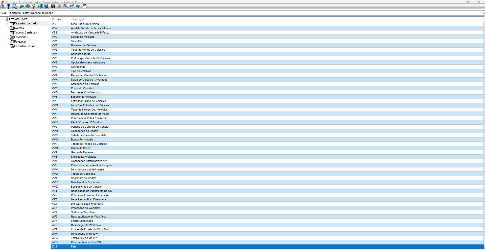
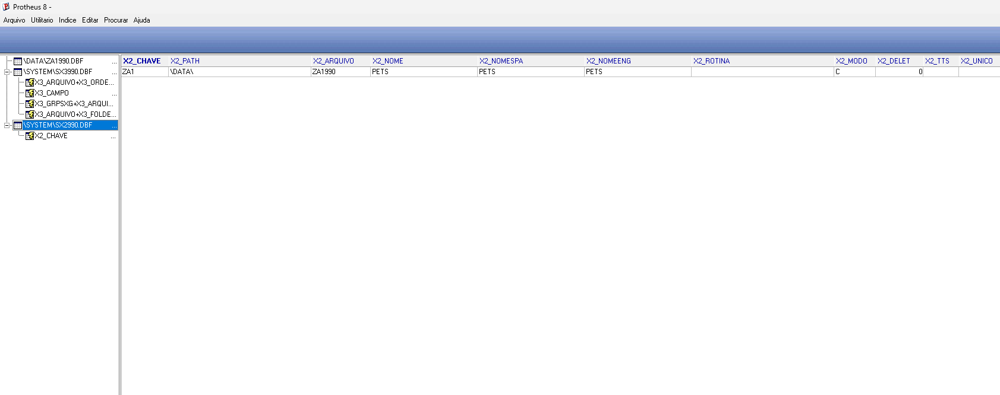
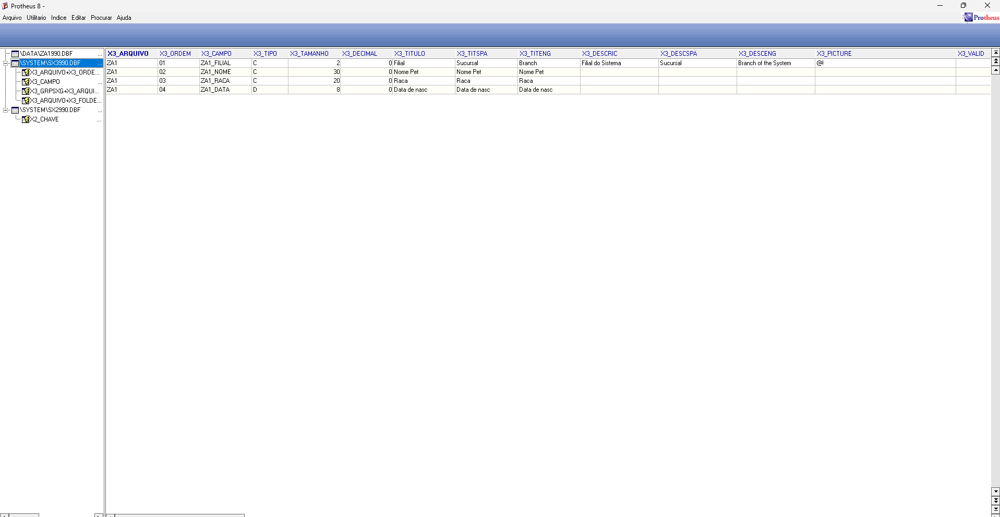
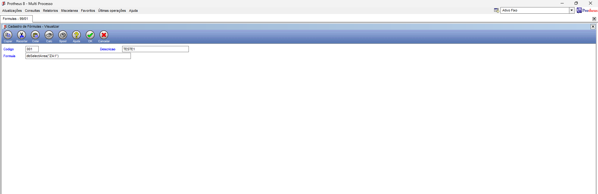
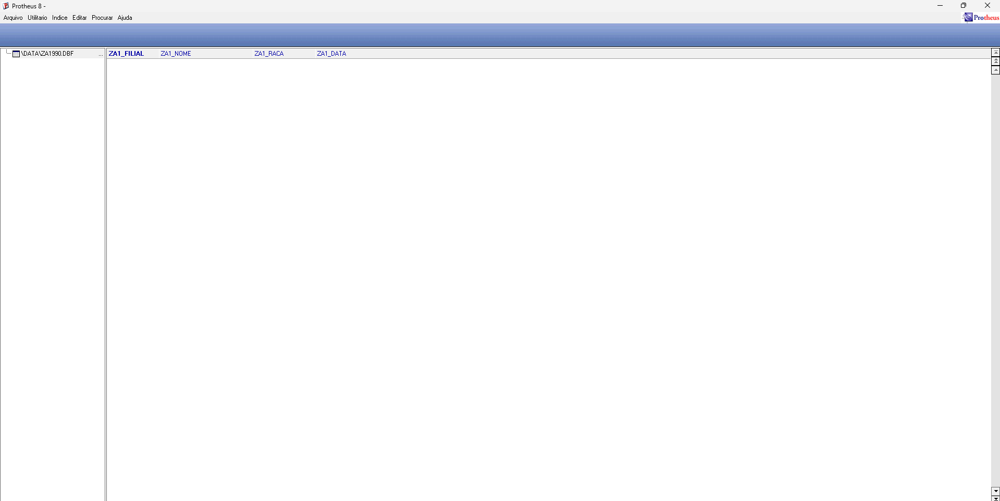

# Exercicio 3 - Recriando a ZA1 no Configurador

## a. Tabela criada no Configurador

Foi criada a tabela ZA1 no Configurador com o nome fisico ZA1990.



---

## b. Registro da tabela no SX2

A tabela foi registrada no SX2, apontando para o arquivo fisico ZA1990.



---

## c. Cadastro dos campos no SX3

Os campos ZA1_FILIAL, ZA1_NOME, ZA1_RACA e ZA1_DATA foram cadastrados no SX3.



---

## d. Reconhecimento da tabela pelo framework

Para forcar o framework a reconhecer e criar a tabela fisica, foi utilizada a seguinte formula:

```advpl
DbSelectArea("ZA1")
```



---

## e. Conferencia no MPSDU

Apos o reconhecimento pelo framework, a tabela fisica ZA1990.DBF foi aberta no MPSDU. Foi possivel confirmar a criacao da tabela e dos campos cadastrados.


