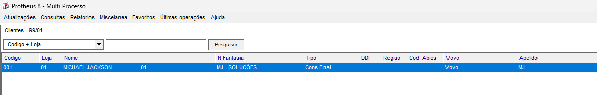

# Exercicio 4 - Campo customizado na SA1

Foi criado o campo customizado **A1_XAPELID** na tabela **SA1** utilizando o Configurador.

**Campo:** A1_XAPELID

**Tipo:** Caractere (C)

**Tamanho:** 10

**Titulo:** Apelido

Apos salvar a alteracao e atualizar a estrutura da tabela, o SmartClient foi aberto novamente. O campo **Apelido** passou a ser exibido na tela de cadastro de clientes, sem a necessidade de desenvolver codigo em ADVPL.

