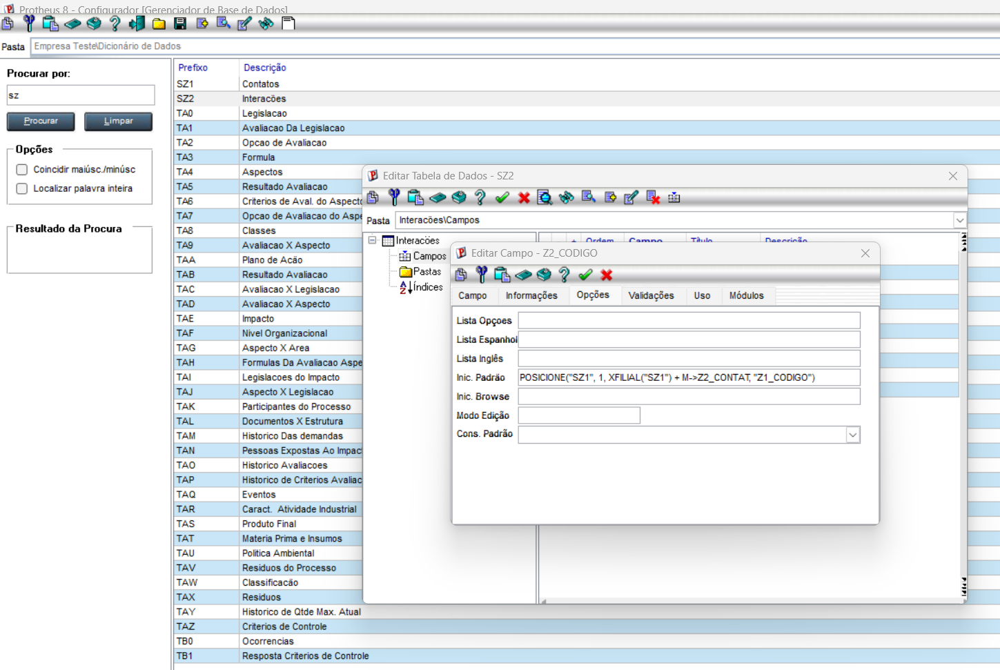
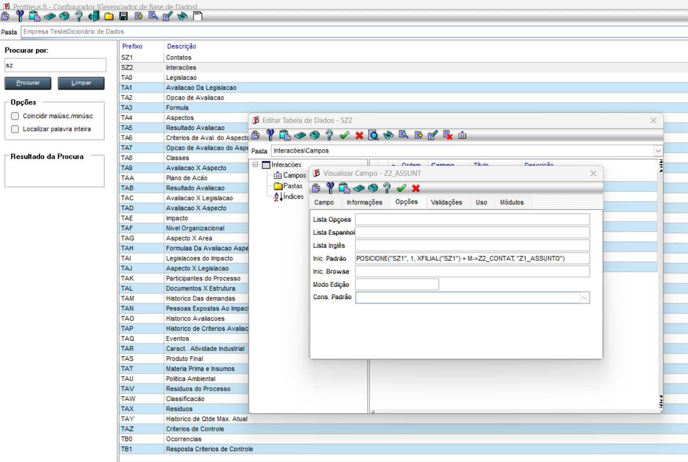
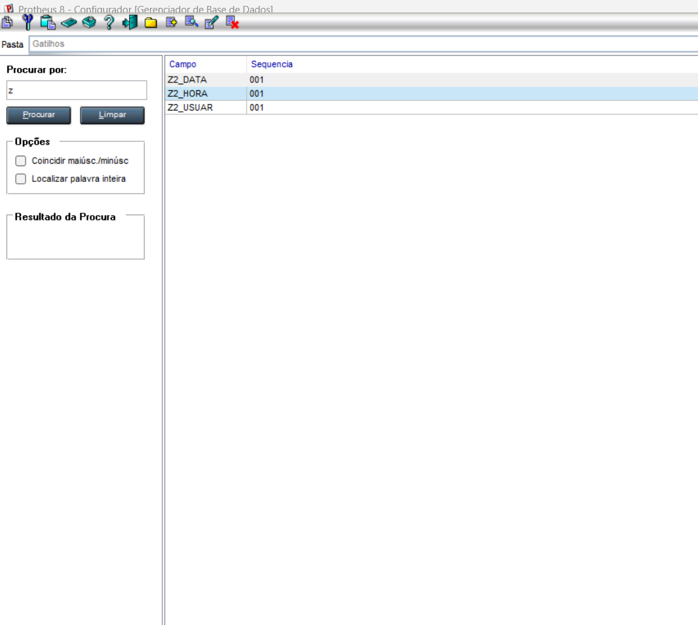
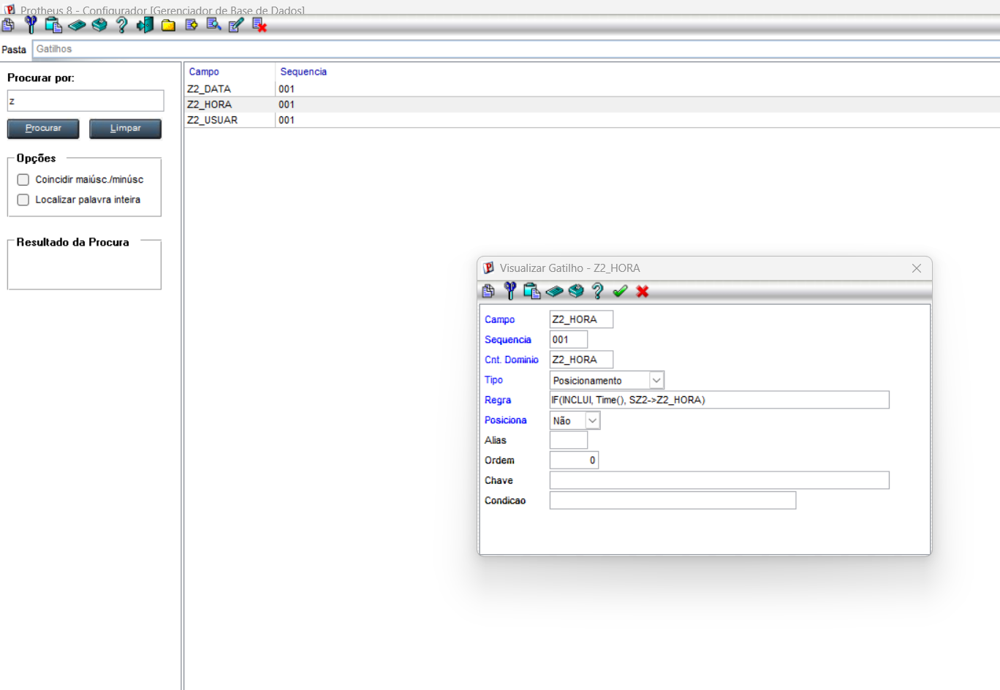
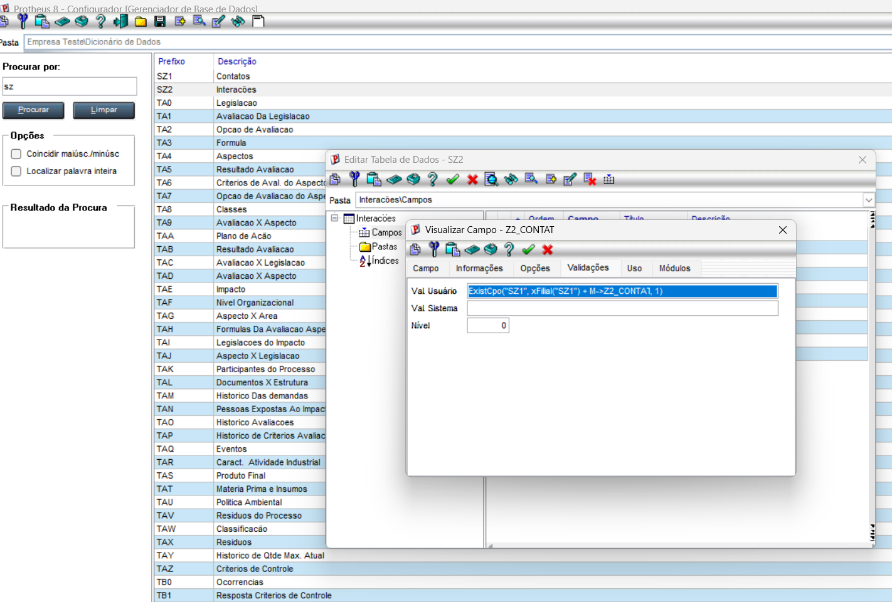

# Exercicio 3 - Gatilhos e Validacoes

## Campo virtual Z2_CODIGO

Foi criado o campo virtual **Z2_CODIGO** utilizando a funcao **POSICIONE()**, permitindo exibir as informacoes relacionadas sem gravar o valor fisicamente na tabela.

---

## Campo virtual Z2_ASSUNT

O campo **Z2_ASSUNT** tambem foi configurado como campo virtual utilizando a funcao **POSICIONE()**, trazendo automaticamente a descricao correspondente.

---

## Configuracao dos gatilhos

Foram criados os gatilhos necessarios para automatizar o preenchimento dos campos durante o cadastro.

---

## Configuracao do campo Z2_HORA

O campo **Z2_HORA** foi configurado utilizando um tipo diferente dos demais, conforme solicitado no exercicio.

---

## Validacao do campo Z2_CONTAT

Foi adicionada a validacao no campo **Z2_CONTAT** utilizando o **Val. Usuario**, garantindo que o contato informado seja validado antes da gravacao.

