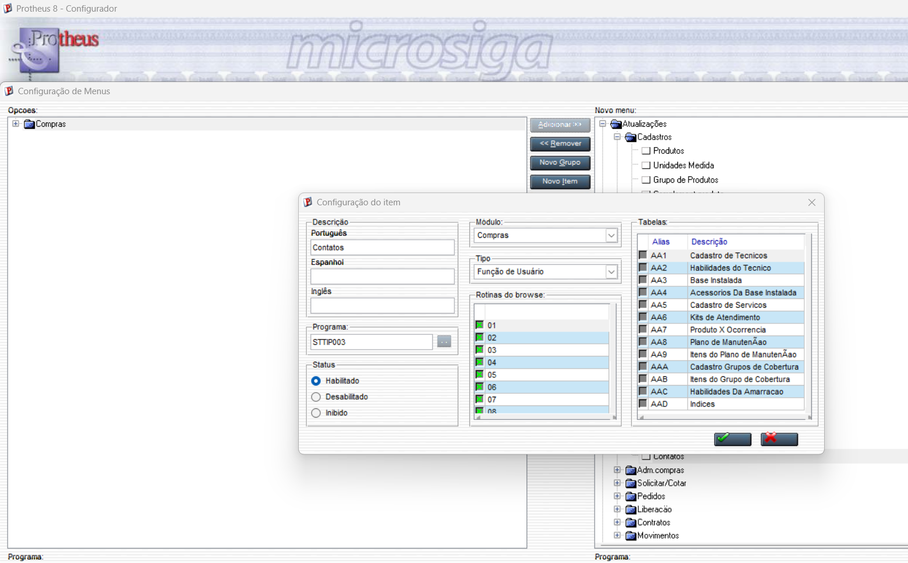
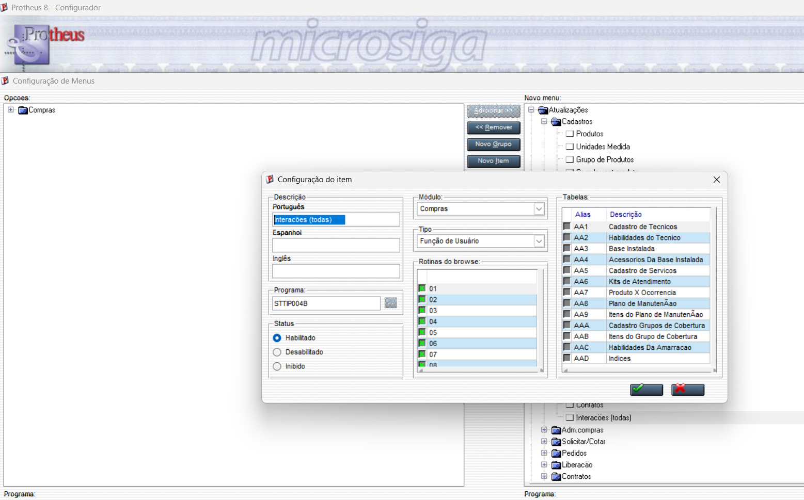
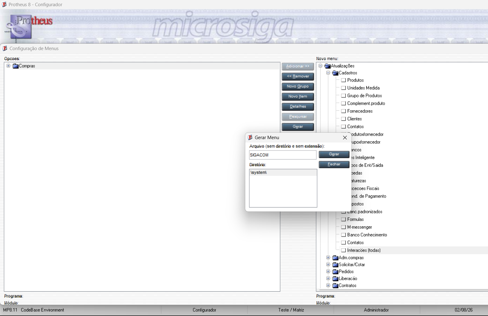

# Exercicio 4 - Menu SIGACOM

## Cadastro de Contatos

Foi criado o menu **Contatos** no modulo **SIGACOM**, chamando a rotina **STTIP003**, responsavel pelo cadastro e gerenciamento dos contatos.

---

## Cadastro de Interacoes

Tambem foi criado o menu **Interacoes**, chamando a rotina **STTIP004**, permitindo acessar o cadastro das interacoes dos contatos.

---

## Configuracao do menu

A imagem abaixo mostra a configuracao realizada para disponibilizar as rotinas no menu do modulo **SIGACOM**.

